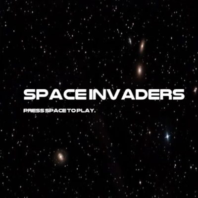
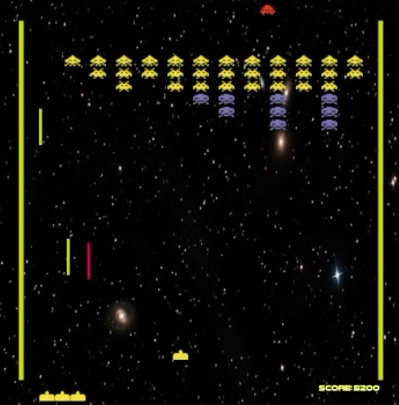
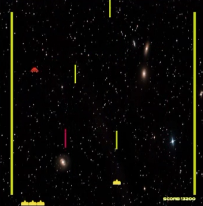
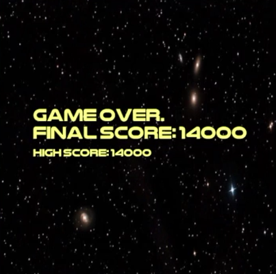

# Space Invaders (C++)

A classic **Space Invaders** inspired game developed in **C++** using object-oriented programming principles and the [Simple Graphics Library (SGG)](https://github.com/cgaueb/sgg).  
The player controls a spaceship, fights waves of invading aliens, avoids enemy attacks, and attempts to survive through increasingly difficult levels.

This project was created as a learning exercise to practice game development concepts, software architecture, and C++ programming.

---

## Tech Stack & Tools

- **C++17** – Main programming language
- **Visual Studio** – Development environment
- **Object-Oriented Programming (OOP)** – Core architecture
- **Custom Game Framework** – Game loop, rendering, and entity management

---

## Goals

### Core Features

- **Player Controls**
  - Move the spaceship horizontally.
  - Fire projectiles at enemy invaders.

- **Alien Enemy System**
  - Multiple alien enemies move across the screen.
  - Enemies descend toward the player as the game progresses.

- **Projectile Mechanics**
  - Lasers are spawned dynamically.
  - Collision detection between lasers and enemies.

- **Level Management**
  - Enemies are organized into waves.
  - Progression through increasingly challenging levels.

- **Game State Management**
  - Handles gameplay flow.
  - Supports game over and victory conditions.

- **Collision Detection**
  - Detects interactions between:
    - Player and enemies
    - Lasers and enemies
    - Enemy attacks and player

### Code Quality & Architecture

- Clear separation of responsibilities across classes.
- Object-oriented design using inheritance and composition.
- Reusable game entities built around a common base class.
- Header/source file organization for maintainability.
- Dynamic object creation and cleanup.
- STL containers used for managing entities and game data.

---

## Project Structure

```text
Game/
│
├── main.cpp
├── GameObject.cpp / GameObject.h
├── Player.cpp / player.h
├── Alien.cpp / alien.h
├── Laser.cpp / laser.h
├── Level.cpp / level.h
├── GameState.cpp / gamestate.h
├── box.h
└── util.h


## Main Classes

### GameObject

Base class for all objects that exist in the game world.

### Player

Handles:

* Player movement
* Input processing
* Shooting mechanics

### Alien

Represents enemy invaders and their behavior.

### Laser

Represents projectiles fired by the player or enemies.

### Level

Controls enemy spawning, wave progression, and level logic.

### GameState

Manages the current state of the game and transitions between states.

---

## How to Run

1. Clone the repository:

```bash
git clone https://github.com/kllmmm/Cpp_Space_Invaders.git
```

2. Open `Game.sln` in Visual Studio.

3. Ensure C++ development tools are installed.

4. Build the project:

```text
Build → Build Solution
```

5. Run the game:

```text
Debug → Start Debugging
```

---

## Controls

| Action     | Key             |
| ---------- | --------------- |
| Move Left  | A / Left Arrow  |
| Move Right | D / Right Arrow |
| Shoot      | Space           |
| Exit       | Esc             |

> Controls may vary slightly depending on the current implementation.

---

## Game Features

* Classic Space Invaders gameplay
* Alien wave system
* Laser combat
* Collision detection
* Level progression
* Game over and victory states
* Object-oriented architecture

---

## Future Improvements

* Score system
* High-score saving
* Sound effects and music
* Power-ups
* Additional enemy types
* Boss battles
* Main menu and settings
* Visual effects and animations

---

## Screenshots

*Add gameplay screenshots here.*

```md




```

---

## Learning Outcomes

This project demonstrates:

* Object-Oriented Programming (OOP)
* Game loop implementation
* Collision detection
* Entity management
* State machines
* Dynamic memory management
* C++ project organization

---

## Contributors

* kllmmm

## License

This project is provided for educational and personal use.
